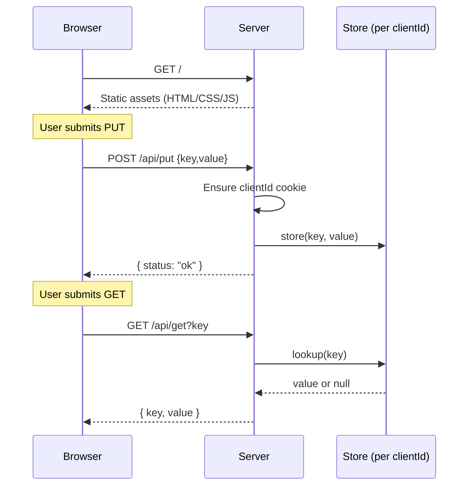

# Assignment 1 (Web)

Web version of the TCP-style key-value store using Node.js and a browser client. Each browser session gets its own in-memory store (session identified by a cookie).

## Quick start

1. Install deps: `npm install`
2. Run server: `npm start`
3. Open http://localhost:3000 in a browser. Use an incognito window to simulate another client/store.

## API

- POST /api/put with JSON `{ "key": "string", "value": "string" }`
- GET /api/get?key=string returns `{ key, value|null }`

## Flow (Mermaid)

```mermaid
flowchart TD
  subgraph Client
    Browser[Browser session]
  end

  subgraph Server
    Static[Serve static files]
    Id[Ensure clientId cookie \n create per-client Map]
    Put[PUT handler]
    Get[GET handler]
    Store[(In-memory store\nper clientId)]
  end

  Browser -->|GET /| Static
  Browser -->|POST /api/put {key,value}| Put
  Browser -->|GET /api/get?key| Get
  Put --> Id
  Get --> Id
  Id --> Store
  Put -->|store key/value| Store
  Get -->|lookup key| Store
  Store --> Response[JSON response]
  Response --> Browser
```

## Sequence (Mermaid)


